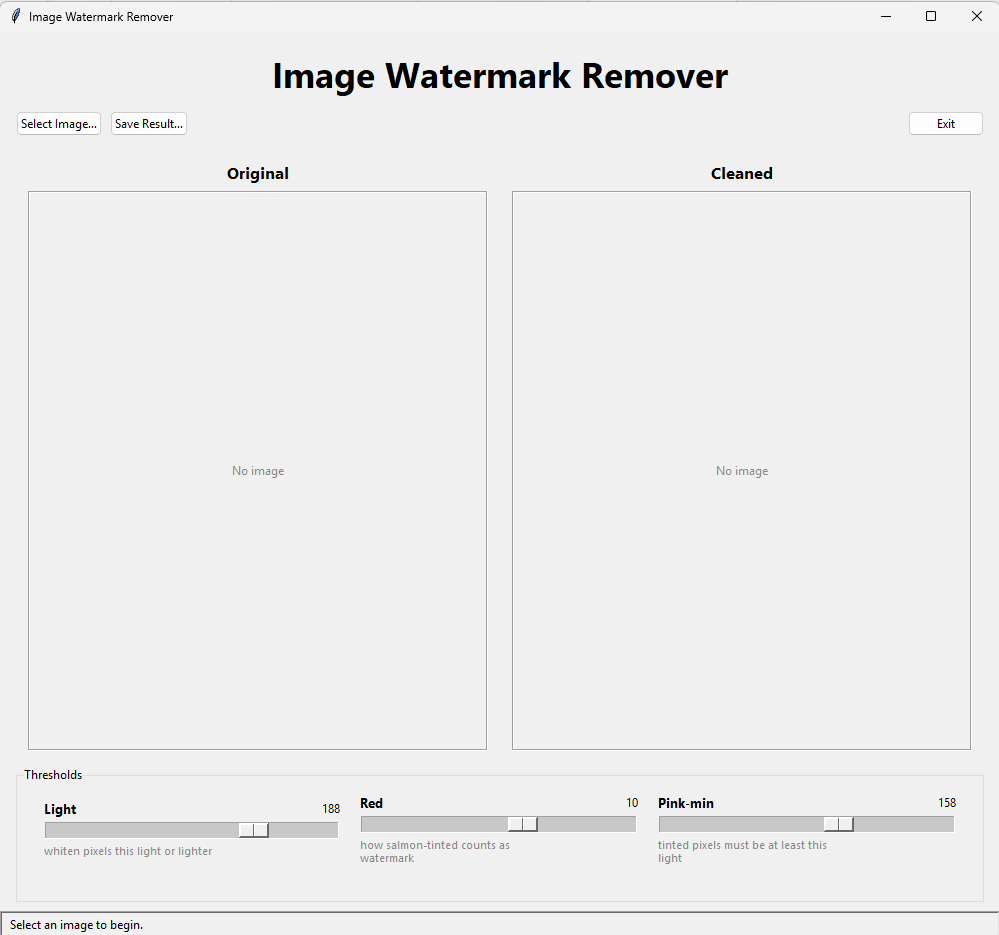
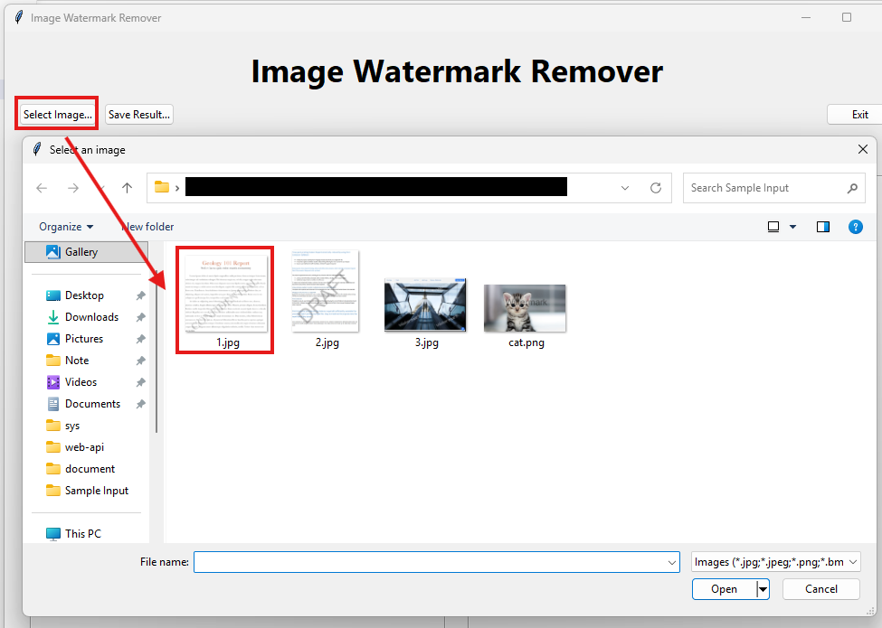
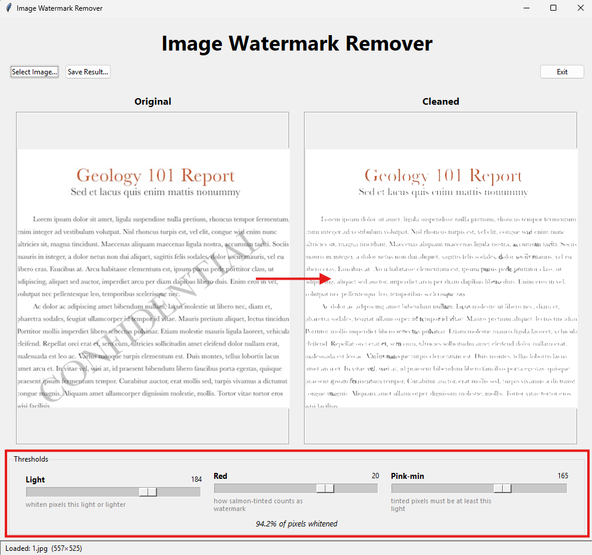
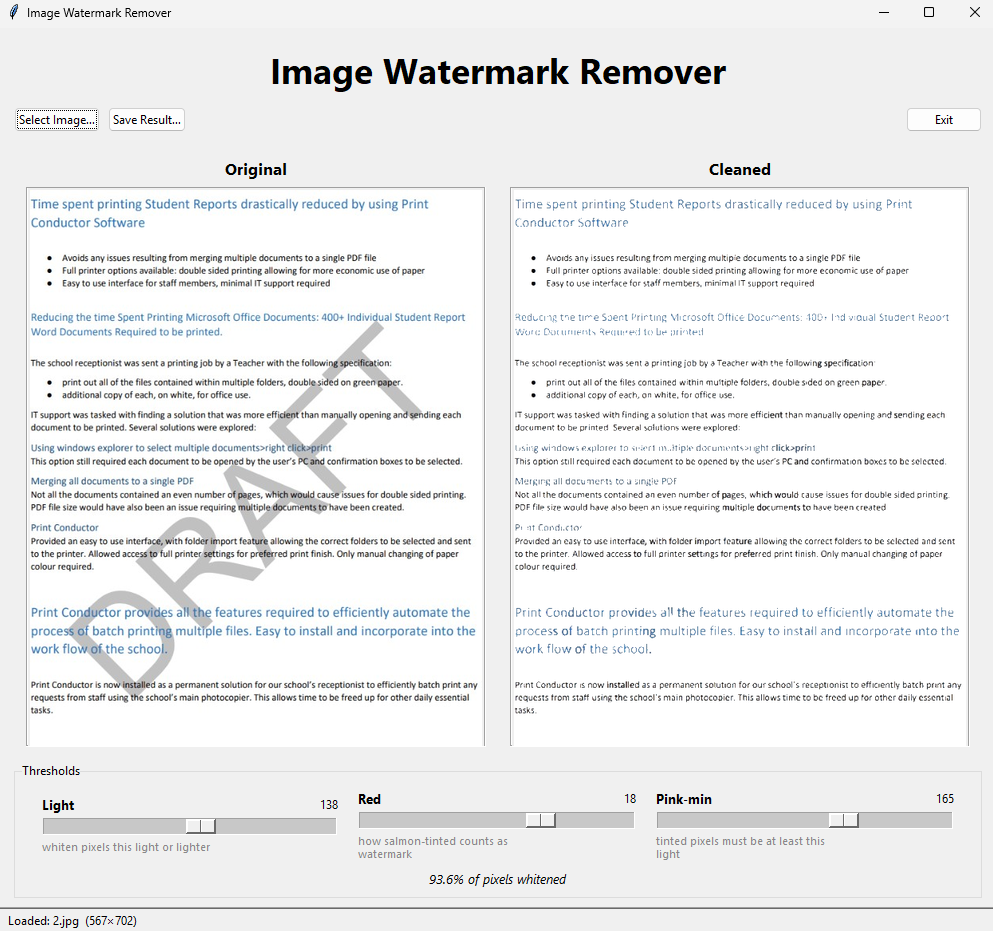

<p align = "center">
	<br>
</p>

- An Image Watermark Remover is a desktop application built in Python with a tkinter GUI (image processing by NumPy + Pillow).
- The user selects any image that has a light, tinted watermark and the watermark is whitened while the dark content is preserved.
- Both the original and the cleaned image are shown side by side in a live before/after preview.
- Three sliders (Light / Red / Pink-min) let the user tune the removal for their own image; a live "% whitened" readout shows the effect.
- The cleaned image can be saved anywhere on the local system using the Save button.

<p align = "center">
	
	
	
	
</p>
<p align = "center">
	
	
	
	
</p>
<p align = "center">
	
	
	
	
</p>
<p align = "center">
	
	
	
	
	
	
</p>
<p align = "center">
	
</p>

---

### 📌REQUIREMENTS :

- Python 3
- NumPy
- Pillow (`from PIL import Image, ImageTk`)
- tkinter (ships with Python; on Debian/Ubuntu: `sudo apt install python3-tk`)

Install everything with:

```bash
pip install -r requirements.txt
```

---

### 📌HOW TO Use it :

- Run it with [uv](https://docs.astral.sh/uv/) — no manual install needed, the dependencies are declared inline in the script:

  ```bash
  uv run image_watermark_remover.py
  ```

  (Or, with a plain Python install: `pip install -r requirements.txt` then `python image_watermark_remover.py`.)

- A single window opens with a toolbar (**Select Image · Save Result · Exit**), two preview panels, and threshold sliders.
- Click **Select Image…** and pick any image that has a light/tinted watermark.
- The **Original** and **Cleaned** previews update side by side; a live "% whitened" figure shows how much was removed.
- If the defaults miss, drag the **Light / Red / Pink-min** sliders — the cleaned preview refreshes as you go.
- Click **Save Result…** to write the cleaned image anywhere on your system.

#### Usage without

```bash
uv run process.py --input "Sample Input" --output "Output"

uv run process.py --input "Sample Input" --output "Output" --scale 2 --svg both --rasterize-svg

uv run process.py --input page.jpg --output Output --scale 4
```

Key options: `--scale {1,2,4}`, `--svg {none,vector,raster,both}`, `--rasterize-svg`,
`--dpi N`, `--trace-scale N`, `--trace-color`, and the raster thresholds
`--light` / `--red` / `--pink-min`. Run `uv run process.py -h` for the full list.

> **Note on fonts:** when rendering an SVG to PNG, text uses the fonts installed on your
> machine. The OCM reports use **TH SarabunPSK** for Thai — that font must be present for Thai
> to render correctly in the PNG (the cleaned `.svg` itself always keeps the real text).

`remove_watermark.py` (raster-only whitening) is still available for simple cases.

---

### GUI tool (`image_watermark_remover.py`)

### 📌Purpose :

- Provides a point-and-click front end over the same cleaning engine as `remove_watermark.py`, so users can remove a watermark without the command line.

### 📌Compilation Steps :

- Run `uv run image_watermark_remover.py` (uv installs NumPy + Pillow automatically; tkinter ships with Python).
- Or install manually with `pip install -r requirements.txt` and run `python image_watermark_remover.py`.
- Select an image, tune the sliders if needed, and save the cleaned result.

---

### 📌SCREENSHOTS :

<p align="center">
  <br>
  <br>
  <br>
  <br>
  <br>
  <br>
</p>

---

### 🌟Stargazers Over Time:

[](https://github.com/akash-rajak/Image-Watermark-Remover/stargazers)
[](https://starchart.cc/akash-rajak/Image-Watermark-Remover)

---

### 🌟Forkers Over Time:

[](https://github.com/akash-rajak/Image-Watermark-Remover/network/members)

---

### 📌Contributors:

<a href="https://github.com/akash-rajak/Image-Watermark-Remover/graphs/contributors">
  
</a>
